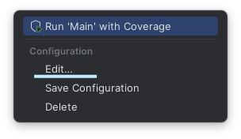
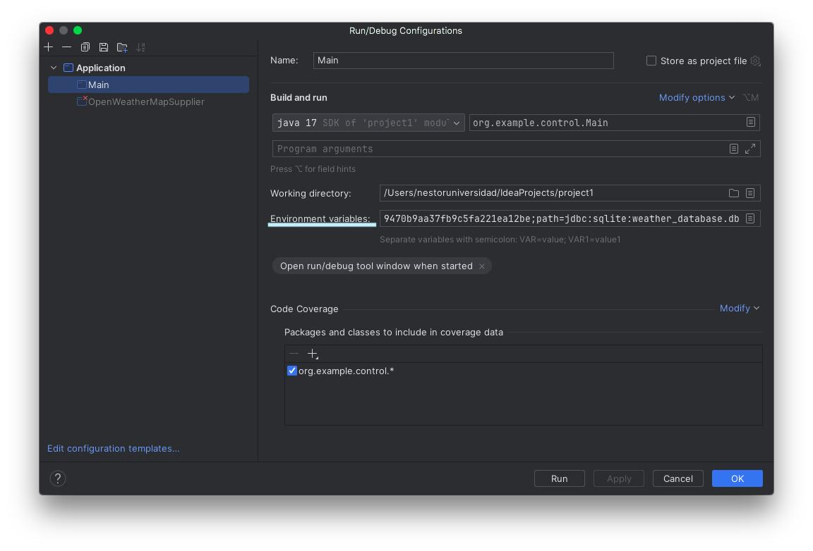
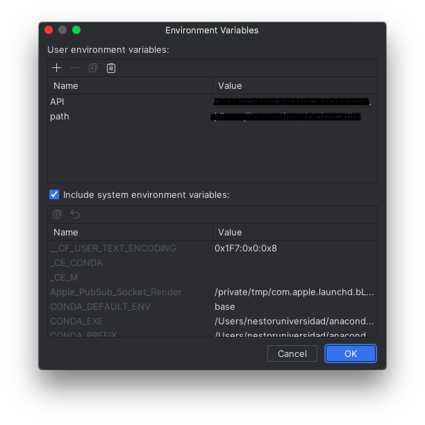
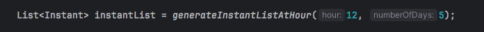
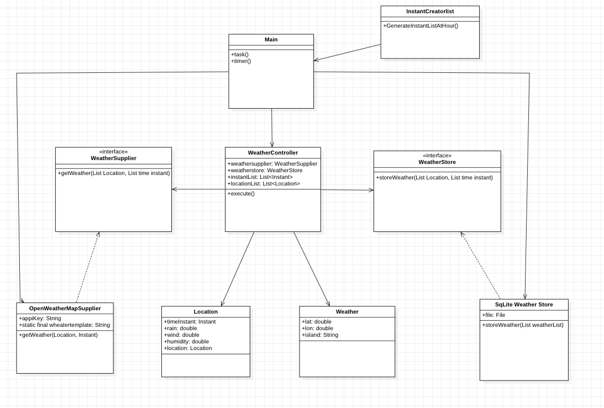

---
output:
  pdf_document: default
  html_document: default
---

# Práctica 1: Captura de datos a partir de fuentes externas.

### Nombre: Néstor Ortega Pérez
### Asignatura: Desarrollo de Aplicaciones para Ciencia de Datos
### Curso: 2º
### Universidad: ULPGC
### Titulación: Ciencia e Ingeniería de Datos
### Escuela de Ingeniería Informática

---

Esta aplicación realiza consultas a la API OpenWeatherMap cada 6 horas para obtener la predicción meteorológica de las 8 islas para los próximos 5 días a las 12pm de cada día. Posteriormente, los datos se almacenan en una base de datos SQLite, con una tabla para cada isla y una entrada para cada día. Se registran la temperatura, probabilidad de precipitaciones, humedad, nubes y velocidad del viento.

---

## Recursos Utilizados

### Entorno de Desarrollo

- **IntelliJ IDEA:** Este proyecto se desarrolla utilizando IntelliJ IDEA como entorno de desarrollo integrado y en lenguaje Java. Se recomienda descargar e instalar la última versión de IntelliJ para una experiencia de desarrollo óptima.

### Control de Versiones

- **Git:** Se utilizó Git como sistema de control de versiones. Para ello, es necesario asegurarse de tener Git instalado localmente. Puede descargar Git [aquí](https://git-scm.com/).

### Construcción y Gestión de Dependencias

- **Apache Maven:** Este proyecto utiliza Maven para la gestión de dependencias y construcción. Asegúrese de tener Maven instalado. Puede descargar Maven [aquí](https://maven.apache.org/).

## Inicio Rápido

1. Clona el repositorio:
    ```bash
    git clone https://github.com/usuario/nombre-del-proyecto.git
    ```

2. Abre el proyecto en IntelliJ IDEA.

3. Construye el proyecto utilizando Maven:
    ```bash
    mvn clean install
    ```

4. Ejecuta la aplicación desde IntelliJ o mediante el comando Maven:
    ```bash
    mvn spring-boot:run
    ```
   
## Otras implementaciones a tener en cuenta.

- Como tanto la `API Key` como el `path JDBC` deben ser privados y no pueden ser vistos por cualquiera, estos deben ser utilizados como variables de entorno dentro del propio proyecto IntelliJ.

- Antes de ejecutar la aplicación, asegúrate de configurar estas variables de entorno en tu entorno de desarrollo.

    1. Accede a este icono que se encuentra en la parte superior derecha:
    
        

    2. Escoge "Edit":
    
        

    3. Añade las variables en "Enviroment variables" y nombralas `API` y `path`:
    
        
        

## Cómo ejecutar el programa.

1. Situarse en el módulo `Main`.

2. Escoger los días y la hora a la que queremos hacer la previsión en el método `generateInstantListAtHour`:

    

3. Ejecutar el programa:

    

# Arquitectura utilizada: Modelo-Control

Este proyecto sigue el principio de diseño Modelo-Control, una variante del patrón de diseño Modelo-Vista-Controlador (MVC). El Modelo-Control se centra en la separación de responsabilidades entre el modelo de datos y el controlador, aunque en este caso no se cuenta con una interfaz de usuario.

### Descripción del Principio

El Diseño Modelo-Control se basa en la división de la aplicación en dos componentes principales:

1. **Modelo:**
   Se definen las clases que representan la estructura de los datos obtenidos de la API. Estas clases reflejan los diferentes tipos de datos que maneja la aplicación.

2. **Controlador:**
   Encapsula la lógica para interactuar con la API. Además, proporciona métodos para realizar solicitudes a la API y recuperar datos. Asimismo, maneja la conexión y las operaciones con la base de datos SQLite, ofreciendo métodos para almacenar datos en la base de datos. Por último, el `WeatherController` actúa como el controlador principal, coordinando las operaciones entre el `WeatherSupplier` y el `WeatherStore`. Es responsable de recibir los datos de la API a través del `WeatherSupplier` y luego almacenarlos en la base de datos a través del `WeatherStore`.

## Diagrama de Clases



